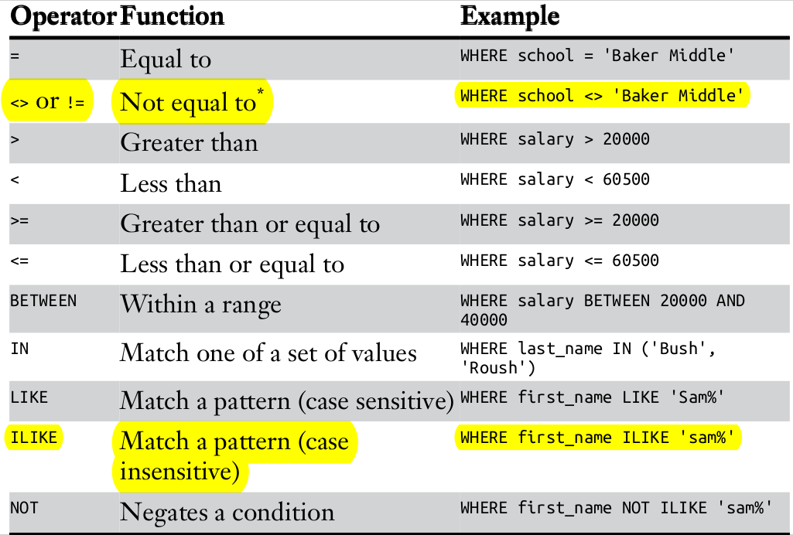

# POSTGRESQL DATABASE

Log into Postgres through commandline use:   
`sudo -u postgres psql` OR `psql -U postgres -h localhost`  

Log into Docker container of Postgres through commandline use:  
`psql -U postgres -p 5400 -h localhost`  


## INTRODUCTION

### CREATING DATABASE

Use: `CREATE DATABASE <database-name>`

### CREATING TABLES  
```
 CREATE TABLE teachers (
  id bigserial NOT NULL,
  first_name varchar(50),
  last_name varchar(50),
  school varchar(50),
  hire_date date,
  salary numeric
 )
```

### INSERTING DATA INTO A TABLE
```mysql
 INSERT INTO teacher 
 (first_name,last_name,school,hire_date,salary) 
 VALUES 
 ('mark','lauren','Unity College','2011-03-16', 33000)
```

### BASIC QUERYING  
1. To select all data in a table:
`SELECT * FROM teacher`  
1. To get the distinct value for a column(school):
`SELECT distinct school FROM teacher`
1. To get distinct values for set of columns: 
`SELECT distinct school, salary FROM teacher`
1. To select all the table data by ordering based on column:
`SELECT * FROM teacher order by salary`

  
Table 1: Comparison and Matching Operators in PostgreSQL

**NB**: 
Percent sign (%) A wildcard matching one or more characters
Underscore (_) A wildcard matching just one character.
```
LIKE 'b%'
LIKE '%ak%'
LIKE '_aker'
LIKE 'ba_er'
```
---  

## DATA TYPES
char
varchar
text

---

## IMPORTING AND EXPORTING DATA


## Building spring boot application images
- Using the basic commands, to do this follow these steps: 
  - run the package command `mvn clean package`  
  - build the jar file using the build command `docker build .`  
  **N:B** this is after the Dockerfile has been written to suit the jar file name.
- Using maven in build docker image build command.  
To do this, just run this command `mvn package dockerfile:build`
- Using buildpack (Check [here](https://docs.spring.io/spring-boot/docs/2.3.0.M1/maven-plugin/html/))  
To do this, run `mvn spring-boot:build-image`


## MISCELLANEOUS
To count the repeated value in a column use  
```mysql
SELECT column_name, COUNT(column_name) AS repetitions
FROM table_name
GROUP BY column_name
HAVING COUNT(column_name) > 1;
```

